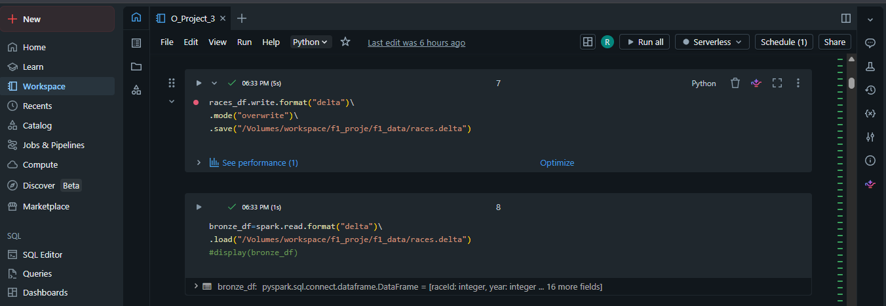
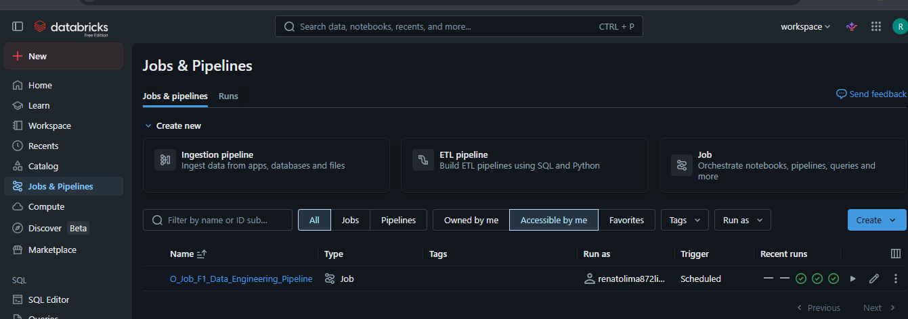

# 🏎️ Projeto de Engenharia de Dados F1

## 📌 Sobre o Projeto

Este projeto foi desenvolvido utilizando conceitos modernos de Engenharia de Dados com foco em processamento distribuído, pipelines ETL e arquitetura em camadas.

O objetivo principal foi construir um pipeline completo de dados da Fórmula 1 utilizando:

* PySpark
* SQL
* Delta Lake
* Databricks
* Arquitetura Bronze / Silver / Gold
* Jobs automatizados
* Processamento de dados em larga escala
# 🏗️ Arquitetura Medallion

O projeto foi desenvolvido utilizando a arquitetura Medallion, separando os dados em camadas Bronze, Silver e Gold.

## Camadas do Pipeline

<p align="center">
  
</p>

### Fluxo do Pipeline

<p align="center">
  
</p>
---

# 🧱 Arquitetura do Projeto

O pipeline foi estruturado em três camadas:

## 🥉 Bronze Layer

Responsável pela ingestão dos dados brutos.

### Atividades realizadas:

* Leitura de arquivos CSV
* Inferência de schema
* Armazenamento inicial dos dados
* Conversão para formato Delta

### Tecnologias utilizadas:

* PySpark
* Delta Lake
* Databricks Volumes

---

## 🥈 Silver Layer

Responsável pela limpeza e transformação dos dados.

### Transformações realizadas:

* Renomeação de colunas
* Remoção de colunas desnecessárias
* Tratamento de dados
* Joins entre tabelas
* Padronização dos dados

### Exemplo:

* Junção entre resultados das corridas e pilotos
* Tratamento de pontuações
* Criação de datasets analíticos

---

## 🥇 Gold Layer

Responsável pela criação das métricas analíticas.

### Métricas desenvolvidas:

* Ranking de pilotos
* Pontuação total
* Ranking de construtores
* Análises por nacionalidade
* Consolidação de resultados

---

# ⚙️ Tecnologias Utilizadas

| Tecnologia    | Finalidade                        |
| ------------- | --------------------------------- |
| PySpark       | Processamento distribuído         |
| SQL           | Consultas analíticas              |
| Databricks    | Plataforma de engenharia de dados |
| Delta Lake    | Armazenamento e versionamento     |
| Git/GitHub    | Versionamento                     |
| Photon Engine | Otimização de execução            |

---

# 📂 Estrutura do Projeto

```bash
Projeto_F1/
│
├── O_Project_3.ipynb
├── README.md
│
├── bronze/
├── silver/
└── gold/
```

---

# 🚀 Pipeline Automatizado

Foi criado um Job no Databricks para automatizar a execução do pipeline.

### Funcionalidades:

* Execução agendada
* Retry automático
* Monitoramento de execução
* Execução Serverless
* Pipeline automatizado ponta a ponta

---

# 📊 Exemplos de Processamentos

## Processamento com PySpark

```python
silver_drivers_df = bronze_drivers_df \
    .withColumnRenamed("forename", "nome") \
    .withColumnRenamed("surname", "sobrenome")
```

## Consulta SQL

```sql
SELECT nationality,
       SUM(points) AS pontuacao_total
FROM results
GROUP BY nationality
ORDER BY pontuacao_total DESC
```

---

# 📈 Principais Conceitos Aplicados

* Engenharia de Dados
* ETL Pipeline
* Data Lakehouse
* Arquitetura Medallion
* Processamento Distribuído
* Data Transformation
* Delta Tables
* Orquestração de Jobs
* Data Analytics
* SQL Analytics

---

# 🔥 Diferenciais do Projeto

✅ Pipeline completo Bronze → Silver → Gold
✅ Processamento distribuído com Spark
✅ Uso de SQL e PySpark no mesmo projeto
✅ Escrita em Delta Lake
✅ Automação com Jobs no Databricks
✅ Estrutura profissional de Engenharia de Dados
✅ Projeto preparado para portfólio

---

# 👨‍💻 Autor

Renato Lima

Projeto desenvolvido para estudos e portfólio em Engenharia de Dados.

---

# 📌 Observação

Este projeto foi desenvolvido utilizando ambiente Databricks Community Edition para simulação de pipelines reais de Engenharia de Dados.
